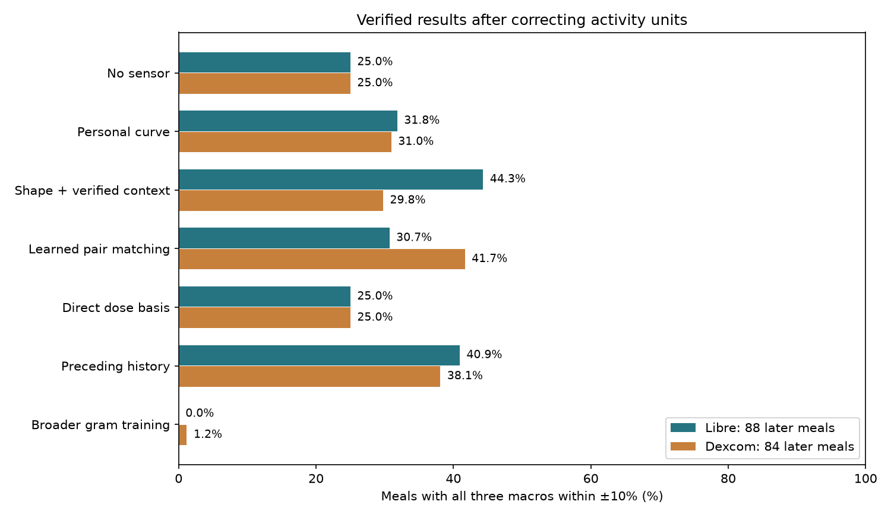

# Continued algorithm investigation

7 September 2026. **Algorithm changes improved prediction of known calibrated recipes, but did not achieve reliable ±10% grams for all macros. There is no proof of impossibility here.**

The previous failed regressions were not treated as a stopping condition. This round tested different representations, a different prediction objective, explicit personal dose-response inversion, learned pair comparisons, additional calibration, longer preceding history, and broader training data.

## Strongest measured progress

All scores below count meals where carbohydrate, protein AND fat predictions are each within 10% of their recorded amounts. Evaluation meals occur after all four initial calibration meals. Population models and their tuning exclude the evaluated person. Libre and Dexcom observe substantially overlapping people; their results are not independent cohorts.

| Approach | Libre: 88 meals / 22 people | Dexcom: 84 meals / 21 people |
|---|---:|---:|
| No glucose: return calibration median macros | 22 (25.0%) | 21 (25.0%) |
| Closest earlier personal glucose curve | 28 (31.8%) | 26 (31.0%) |
| Shape/representation/context selection inside training participants | **39 (44.3%)** | 25 (29.8%) |
| Same selection restricted to glucose inputs | 35 (39.8%) | 28 (33.3%) |
| Learn a comparison between query and calibration pairs | 27 (30.7%) | **35 (41.7%)** |
| Direct continuous grams from personal dose-response basis | 22 (25.0%) | 21 (25.0%) |
| Add preceding glucose history and clock time | 36 (40.9%) | 32 (38.1%) |
| Continuous gram models trained on broader usable meals | 0 | 1 (1.2%) |

These are separate exploratory approaches. Choosing the best approach after seeing this table is not another unbiased test. The same dataset has been inspected and used for development repeatedly. Nested tuning protects each individual run from using that test person's labels in fitting, but it does not erase analyst adaptation across rounds.

The Libre shape/context approach has mean absolute errors of approximately **9.1 g carbs, 11.0 g protein and 11.8 g fat**. That is useful progress relative to the earlier regression's protein error, but is still far from the requested margin. Correctly identifying a recipe returns its exact stored macro label; it does not establish that an unfamiliar portion can be estimated to that precision.

**Verification correction:** the provisional context result of 42/88 Libre and 26/84 Dexcom mixed activity fields with unverified units. I corrected METs to its documented scale, treated unknown-unit Intensity as missing, reran the affected configurations and recomputed training-only selections. The verified results are 39/88 and 25/84. Glucose-only results and the additional-participant check below are unchanged. Raw earlier outputs remain for provenance; use `shape_probe_verified/` for current context results.

## Additional-participant check

Before evaluating the additional participants, I froze a fixed method selected from the earlier cohort's results and trained it on that earlier cohort. The additional people had sufficient four-meal calibration but fewer than four usable later repeats, and had not participated in the first model comparison.

| Frozen method | Additional people | Later meals | All three within 10% | No-sensor reference |
|---|---:|---:|---:|---:|
| Libre, calibrated rich features + RBF SVM | 10 | 19 | **11/19 (57.9%)** | 4/19 |
| Dexcom, normalized shape + linear SVM | 10 | 20 | 5/20 (25%) | 4/20 |

The Libre result supports investigating the signal further. It is too small and inconsistent across devices to validate the product. A participant-bootstrap interval for its hit rate is roughly 39–81%; this interval does not account for all research choices. It is not a 58% guaranteed future accuracy.

This was an additional retrospective check within the same source dataset, not an external trial. These people have now been examined and some were subsequently included in the broader-training experiment below. They must not be recycled as an untouched validation set for further development.

All 19/20 predictions, including the misses, are in [additional-participant predictions](shape_probe/additional_people/predictions.csv).

## What was changed and why

**Avoid averaging different plausible recipes.** The original regression often returned intermediate protein/fat values. I evaluated identification of the correct recipe from the four known calibration recipes. A correct identification supplies all three labels. There are 72 combinations of representation, one/two/three-hour windows and classifier settings: normalized shape, calibrated amplitude differences, timing summaries, dynamic-time-warp distances, and optional context. Classifiers include shrinkage discriminant analysis, linear/RBF support vector machines and randomized trees. Selection uses participant-grouped validation inside the training cohort. The optional context includes heart rate, activity fields, age, BMI and baseline HbA1c; the glucose-only result is reported separately.

**Learn how two responses should be compared.** A second approach learns whether a query/calibration pair belongs to the same recipe, from relative amplitude, shape products, slopes, baseline changes and the candidate calibration meal's known macros. All four candidates for each query stay together in every split. Five settings were evaluated with grouped training-only selection. This helped Dexcom more than Libre.

**Estimate continuous doses directly.** Each person's three differences from the reference meal form a basis: the change associated with carbohydrate, protein and fat. The algorithm finds a bounded combination of those effects and maps the coefficients to grams. This assumes additive response effects within the calibration range; it is a tested modeling assumption, not established physiology. Seventy-two baseline/window/prior/regularization combinations were compared, with settings selected using other people. The selected method did not improve joint hit rates beyond the baseline. It supplies continuous outputs, but not dependable continuous-dose recovery.

**Use more labeled onboarding.** I supplied one, two or three additional earlier labeled meals, then evaluated only the meals that followed. I compared original templates against the latest same-recipe template, a common time-varying correction, and a common gain/offset correction. Controls use exactly the same remaining queries, preventing an easier query subset from masquerading as a calibration improvement. None produced a consistent large improvement across devices. More onboarding could still help with a richer dataset; this test only covers the available repeats.

**Use preceding history rather than just the current response.** I added 1, 6 or 12 hours of earlier glucose, changes relative to calibration histories, missingness information and clock time. Prior meal macros and study-day numbers were not inputs. Fifteen representation/classifier settings were tested with grouped tuning. This did not outperform the strongest earlier approach. It does not establish that all possible state/history models are exhausted.

**Train continuous gram models on more than the repeated shakes.** After label, chronology and sensor checks, 286 post-calibration meals from 32 Libre participants and 259 from 31 Dexcom participants were available. Each held-out person was excluded from model fitting, so each fold uses fewer than those totals. Training could include usable lunches, dinners and other labeled meals from the other people. Five ridge/tree/absolute-error regression settings were tuned on grouped training folds. Evaluation remained on the same 88/84 breakfast queries, preserving comparability. One Dexcom query and no Libre queries met the joint tolerance under selected models. Broader food variety and label uncertainty may complicate this transfer; more rows did not automatically make the target easier.

**Combine trained approaches.** Weighted votes among the top 3, 5 or 9 configurations, ranked using each outer fold's inner scores, were also evaluated. They did not reach the requested goal. These ensemble sizes were compared exploratorily, not chosen on an independent final cohort.

## Fat is still specifically weak

Under the Libre shape/context model, 10 of 22 high-fat meals are recognized as high-fat. Low-fat recognition is 45 of 66. Thus balanced high/low-fat accuracy is about 57%, even though all-three recipe identification improved. The corresponding Dexcom model is approximately 57% balanced for fat. Predicting low fat on every meal gets 75% ordinary fat accuracy in this four-recipe menu, illustrating why the no-sensor and balanced-dose controls matter.

These checks establish some distinguishable signal, not a dependable 10% fat meter. There are still no pure-fat meals in this dataset, so pure-fat performance cannot be validated here.

## Scope of what can be concluded

The strongest results use a closed menu: 66C/22P/10.5F, 24C/22P/10.5F, 66C/66P/10.5F and 66C/22P/42F. Classifying those four recipes is an easier, narrower problem than recovering arbitrary grams, unfamiliar combinations, unannounced snacks or daily totals. The improvements should be kept; they must not be renamed as general macro measurement.

The data supports further research. It does not currently justify saying that the 10% target is achievable merely by continuing to adjust algorithms. Conversely, failure of these methods does not prove that a better method, more reliable measurements, more calibration or additional signals cannot work. It is not possible to certify universal impossibility from this finite observational dataset.

The concrete validation limit is narrower and certain: absent pure-fat examples and sparse dose coverage prevent this dataset alone from validating the full arbitrary-meal claim. Fresh, independently evaluated, accurately labeled meals are required before making that claim, whatever algorithm is used.

## Reproducible files

- [Verified shape/context predictions and actual gram labels](shape_probe_verified/predictions.csv)
- [Additional-participant predictions](shape_probe/additional_people/predictions.csv)
- [Direct continuous-dose predictions](inverse_basis/predictions.csv)
- [Pair-comparison results](pair_probe/predictions.csv)
- [Additional calibration comparisons](extra_calibration/all_results.csv)
- [History predictions](history_probe/predictions.csv)
- [Broader-training gram predictions](mixed_grams/predictions.csv)
- Training-only selections and scores are stored alongside each experiment.

The computational routines are `shape_probe.py`, `additional_people.py`, `inverse_basis.py`, `pair_probe.py`, `extra_calibration.py`, `history_probe.py` and `mixed_grams.py`. The broader-training run was restarted with one numerical-computation thread after excessive parallel overhead; the replacement run completed. Source CSVs were not changed.
