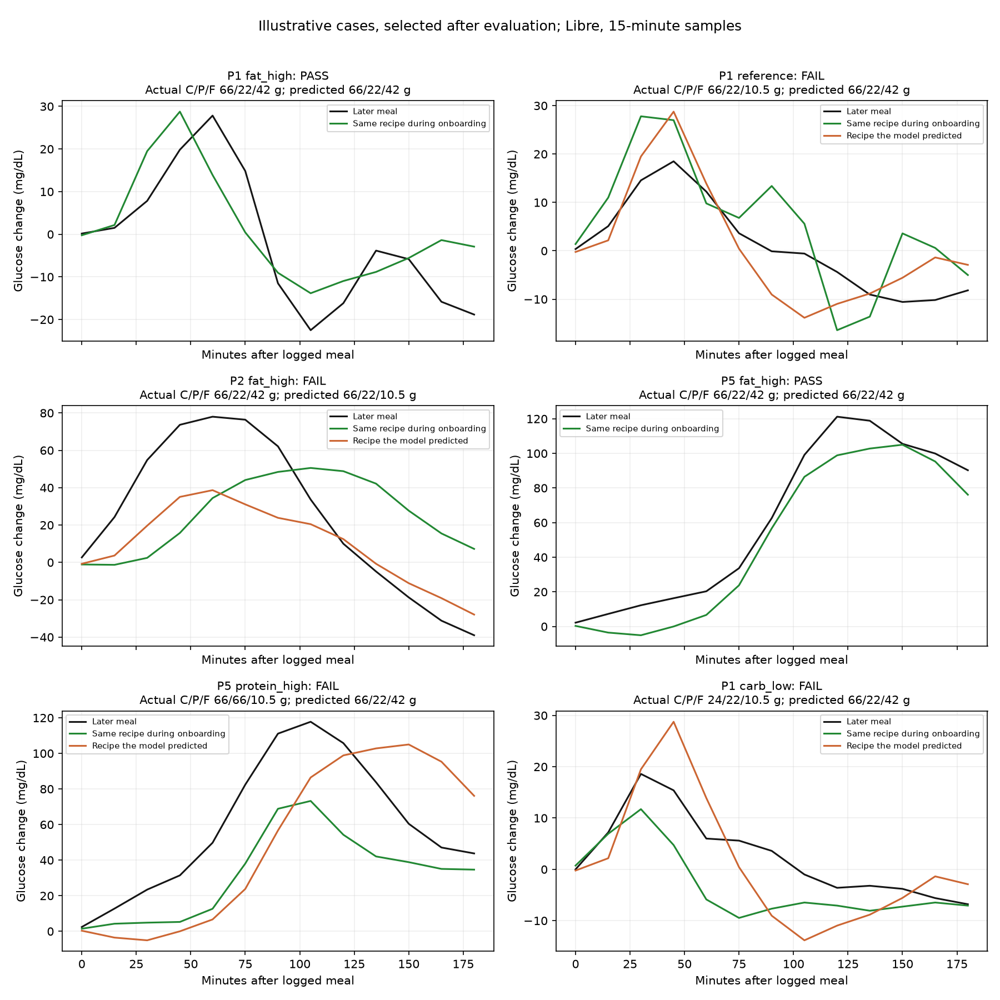

# Why predictions failed

7 September 2026. Post-hoc analysis of saved predictions, checked against raw glucose samples and actual meal records. These comparisons diagnose development results; they are not a new independent validation set or proof of causal mechanisms.

## What actually failed

The verified recipe model got all three macros within 10% in 39/88 Libre meals and 25/84 Dexcom meals. It returns one of four calibrated macro combinations. Here is the breakdown:

| Actual recipe | Libre correct | Dexcom correct |
|---|---:|---:|
| Low carbohydrate | 13/22 | 10/21 |
| High fat | 10/22 | 10/21 |
| High protein | 8/22 | 1/21 |
| Reference | 8/22 | 4/21 |

Fat is not the only problem. On Libre, nine high-protein meals were called high-fat; on Dexcom, ten were. The model often assigns the wrong explanation to the glucose response.

## Direct comparisons of real meals

All grams below are carbohydrate / protein / fat, in that order. Examples were selected after evaluation to illustrate mechanisms, not to estimate accuracy.

| Person and meal | Actual grams | Predicted grams | What the raw curve shows |
|---|---|---|---|
| P1 high-fat repeat, May 9 | 66 / 22 / 42 | 66 / 22 / 42 | Correct onboarding curve was the closest. |
| P1 reference repeat, May 7 | 66 / 22 / 10.5 | 66 / 22 / 42 | Same person, but the later low-fat meal resembled the high-fat onboarding response more closely. |
| P2 high-fat repeat, Nov 23 | 66 / 22 / 42 | 66 / 22 / 10.5 | Correct high-fat template differed by 39.6 mg/dL RMS; the nearest wrong template differed by 25.9. Premeal baseline was also 29.7 mg/dL higher than during high-fat calibration. |
| P5 high-fat repeat, Aug 25 | 66 / 22 / 42 | 66 / 22 / 42 | Correct high-fat template was closer: 12.8 versus 25.1 mg/dL RMS for the nearest alternative. |
| P5 high-protein repeat, Aug 24 | 66 / 66 / 10.5 | 66 / 22 / 42 | The high-protein repeat response was larger than its calibration response and closer to the high-fat template. |

The figure uses baseline-subtracted 15-minute samples. RMS measures whole-curve distance, not peak difference or fat concentration. The model uses additional representations/context, so nearest-template distance is a diagnostic rather than its exact decision rule.

## Failures compared with successes

For Libre, 40/49 failures had a wrong recipe closer than the true recipe in raw curve distance. Median same-recipe repeat distance was 23.4 mg/dL among failures versus 15.4 among successes. Median baseline change was 11.4 versus 7.6 mg/dL. Median peak-time change was 21 versus 12 minutes.

This is evidence of response variability associated with mistakes. It does not establish whether sleep, activity, physiology, sensor error, meal timing or labeling caused that variability. Moreover, 20/39 successes also had a wrong recipe closer, while nine failures had the correct recipe closest. The model sometimes resolves raw ambiguity and sometimes introduces errors; blaming everything on missing data would be wrong.

For Dexcom, 44/59 failures versus 14/25 successes had a wrong recipe closer. Median same-recipe distance was 28.0 versus 19.7 mg/dL.

Among 80 meals evaluated on both devices, both models were correct on 15, both wrong on 36, Libre alone correct on 22 and Dexcom alone correct on seven. They gave the same recipe prediction on only 35/80. Different models and sensor signals both contribute, so this does not isolate sensor error or prove that combining devices will solve it.

## What the broader gram test found

A new fixed continuous model trained on other participants and adjusted its predictions using four earlier labeled meals from the evaluated person. Its primary settings were specified before execution, with additional fixed sensitivity methods reported separately. Query food identity, calories, macro labels and study day were not inputs.

The primary method met the joint 10% tolerance on **0/286 Libre meals and 0/259 Dexcom meals**. These include lunches, dinners and snacks, rather than just repeat shakes. Libre mean absolute errors were 21.5 g carbohydrate, 22.0 g protein and 11.9 g fat. This model failed; it does not establish an accuracy limit for all possible models.

The source of extrapolation is unusually concrete: 177/179 unfamiliar Libre meals and 153/155 unfamiliar Dexcom meals lie outside the convex hull of the four onboarding macro vectors. Only two unfamiliar meals per device fall inside it. A convex hull is the set of macro combinations obtainable by averaging those onboarding vectors. Population data can support extrapolation, but four onboarding recipes do not directly calibrate it. This geometric fact alone does not explain errors on familiar recipes.

## Missing evidence and what it would resolve

| Missing or inadequate information | Why it matters | What obtaining it could establish |
|---|---|---|
| Repeated, independently varied macro amounts and combinations within each person | Current calibration has sparse levels and almost no unfamiliar meals inside its calibrated combinations. | Whether a continuous dose relationship generalizes to held-out amounts, including combinations. It cannot be established by recognizing four recipes. |
| Repeated identical meals across different days with recorded premeal conditions | Identical labeled recipes produce different curves. Baseline and history are already partly available and have been tried. | Which measured conditions account for repeat variability, if any. Additional context is not guaranteed to fix it. |
| Accurate intake timing, amount actually consumed, and independently checked macro labels | The target is only as trustworthy as its reference measurement. Portion-field anomalies and label inconsistencies exist; the primary analysis filters obvious ones. | Whether a 10% error is in the estimator or its recorded reference. Verification cannot assume nutrition labels are chemical assays. |
| Longer isolated responses for the same test meals | Only 27/88 Libre and 28/84 Dexcom repeat queries have a valid five-hour isolated window under existing rules. | Whether later information distinguishes currently confused meals. Existing data cannot fairly support extending every three-hour test to five hours. |
| Pure-fat examples | There are none in this source dataset. | Direct measurement of pure-fat detection and dose performance; current results say neither success nor impossibility. |
| A fresh evaluation cohort or prospectively withheld meals after freezing the pipeline | This dataset has been repeatedly inspected during development. | Whether an apparent improvement survives analyst adaptation and new observations. |

The data includes CGM, heart rate and activity; it does not contain synchronized postmeal insulin, triglyceride or amino-acid time series. Those are candidate additional research measurements, not demonstrated fixes. A new biomarker would need to show independent predictive value on held-out meals before being called necessary or sufficient, and blood measurement would not establish sweat feasibility.

**No missing field can honestly be said to have guaranteed success.** The strongest actionable diagnosis is that we must separate unstable repeat responses from sparse dose coverage. First quantify predictable repeat variability; then test continuous amounts and mixed combinations withheld from fitting. Achieving the user target requires success on both, followed by a fresh test. Logged meal timing and exclusion of overlapping food also mean these experiments do not yet test automatic meal detection or complete daily totals.

## Verification and artifacts

All 45 raw CSV hashes still match the original audit. The new model's calibration and query IDs are disjoint and chronological, and evaluated participants are absent from population training. All saved tolerance flags were independently recomputed from predicted and actual grams. An initial diagnostic merge error was fixed and the entire diagnosis rerun successfully; the displayed outputs are from the completed run.

- [Every recipe-model case and raw-response diagnostics](case_diagnostics.csv)
- [Same-meal comparisons across devices](paired_device_cases.csv)
- [Illustrative cases and their exact IDs](illustrative_cases.csv)
- [Aggregated diagnostic results](summary.json)
- [Every continuous-gram prediction](../personal_grams/predictions.csv)
- [Continuous-gram model results, including controls](../personal_grams/summary.json)
- [Calibration and held-out participant manifest](../personal_grams/split_manifest.json)
