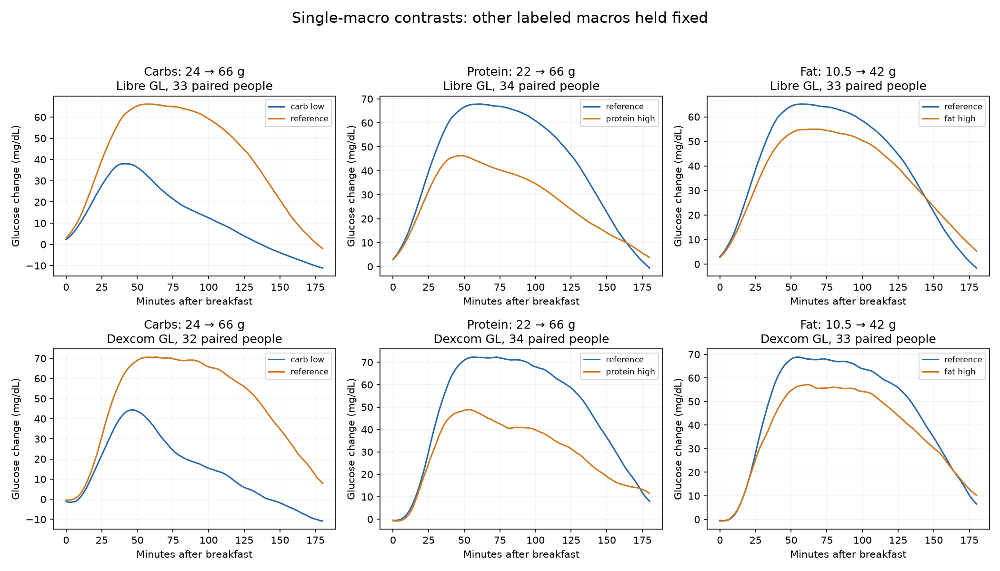
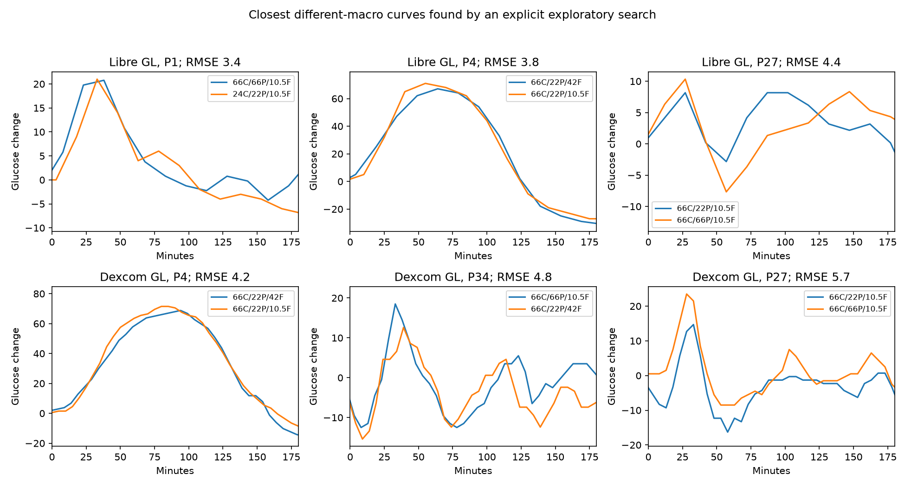

# Can these measurements support predictions of carbohydrate, protein and fat grams?

Audit completed 7 September 2026. This is a prerequisite audit, not a trained-model result or proof of commercial viability. All 45 participant files and 1,706 meal records with three macro labels were examined programmatically. Controlled contrasts, repeats and selected ambiguous curves were examined visually. Not every food photograph was interpreted.

**Decision:** there is enough data for an honest, personalized, controlled-breakfast prediction experiment for all three macros. There is not enough evidence to promise accurate grams for arbitrary meals, pure fat, or complete days. The strongest opportunity to test now is whether a person's known-meal calibration improves later predictions beyond simply guessing from their usual meals.

## What the original researchers actually did

The [2025 CGMacros paper](https://www.nature.com/articles/s41597-025-05851-7) primarily supplies the dataset. Its technical validation predicts two-hour glucose AUC/iAUC from known macros and participant measurements, the reverse of our task. Its correlations are not gram-prediction accuracy. The population includes healthy, prediabetic and type 2 diabetic participants. Breakfasts are prescribed shakes, lunches prescribed restaurant meals, dinners freely chosen. Food times come from participant submissions. Baseline blood measurements are not continuous post-meal insulin or lipid measurements. The released minute-by-minute glucose values include interpolation from devices sampling less frequently.

The [2019 inverse-model paper](https://arxiv.org/pdf/2206.11878) already attempted all three macros from CGM, including personalized testing. It used a small controlled cohort, nine mixed-meal recipes and eight-hour responses. All recipes contain substantial carbohydrate. Its fat quantities are in millilitres, not grams. It is proof that the inverse question has been experimentally studied, not validation of a fat-only or free-living product. Full paper read; local copy at `reference/inverse_models/cgm2019.pdf`.

The [2021 subject-independent inverse-model paper](https://psi.engr.tamu.edu/wp-content/uploads/2021/08/ICASSP_21_SubjectIndependentIMM_CameraReady.pdf) is especially relevant to onboarding. Full five-page author copy read. It uses 15 participants, nine controlled meals, eight-hour sedentary responses and held-out-person evaluation. Table 5 explicitly compares normalization using all meals with calibration using two contrasting meals. Two-meal calibration reports relative RMS errors of 28% carbohydrate, 47% protein and 40% fat. These percentages are errors, not accuracy, and fat labels are millilitres. Normalization over a person's complete collection is not equivalent to predicting their first future meal; the two-meal condition is closer to deployment. The paper does not establish performance on unfamiliar solid meals or pure-fat meals.

The [2024 constraints-and-priors paper](https://psi.engr.tamu.edu/wp-content/uploads/2024/08/anurag-BSN24-macro.pdf) uses the same breakfast schedule as CGMacros. Full four-page author copy read. It encodes macro effects together and uses meal priors to recover **net carbohydrate**. Reported relative RMS error falls from 51% for direct prediction to 40% with meal priors, and 37% when true protein/fat are supplied. The last condition is an oracle comparison, not a glucose-only product. It does not report independently recovering all three macros. Its coefficient selection explores a grid; an independent replication should tune that choice inside training. Table I's day-10 carbohydrate value differs from the current CSV recipe. This is another reason to pin the data version and target definition.

The [blood-biomarker study](https://psi.engr.tamu.edu/wp-content/uploads/2021/12/jbhi-aminoacids-2021-preprint.pdf), read in its full ten-page author-preprint version, analyzes 87 meals from ten people with repeated blood samples. It uses glucose, amino acids, insulin and triglycerides, eight-hour responses, and nested participant validation for model hyperparameters. Additional markers improve predictions, especially protein; triglycerides alone do not significantly beat CGM for fat in the reported comparison. Biomarker selection is based on exploratory rankings and needs independent confirmation. This supports investigating extra chemical signals, but these are blood assays, not evidence that a sweat patch measures the same information. Protein-source and liquid-meal limitations are acknowledged by the authors. The final journal PDF was not retrieved; this audit uses the identified preprint.

These papers are related studies, some sharing cohorts; they should not be counted as independent large replications. This audit is not an exhaustive novelty or patent review.

## 1. We can see an effect for each macro

For each contrast, the other labeled macros and fiber are fixed. Only breakfasts marked 100% consumed are in the primary analysis. We require a usable pre-meal baseline, complete three-hour glucose, no following logged food in that window, and no previous logged food within three hours. Unknown preceding food history is allowed but is not certified fasting. Each person's repeat responses are averaged before comparing conditions.

| Change | Libre finding | Dexcom finding |
|---|---|---|
| Carbs 24 → 66 g; protein 22 g, fat 10.5 g | Higher three-hour mean response in 32/33 people; median difference +23.6 mg/dL | Higher in 29/32; +30.4 mg/dL |
| Protein 22 → 66 g; carbs 66 g, fat 10.5 g | Lower mean response in 30/34; median −14.7 mg/dL | Lower in 30/34; −15.1 mg/dL |
| Fat 10.5 → 42 g; carbs 66 g, protein 22 g | Later peak in 22/33; median delay 10.5 minutes | Later peak in 26/33; median delay 11 minutes |

Both devices observe the same participants, not two independent cohorts. These are descriptive contrasts, not randomized causal estimates or prediction accuracy. Changing the baseline from the preceding ten-minute median to the meal-start value preserves the overall mean-response patterns.

## 2. The central uncertainty is separating effects, not whether an effect exists

Less carbohydrate and more protein can both reduce a curve. Fat also modifies its height and timing. A single response can therefore resemble more than one macro combination.

Concrete example: participant 4, September 14 versus September 17 in the shifted dates. Both breakfasts have 66 g carbs and 22 g protein, but fat is 42 versus 10.5 g. Their baseline-adjusted three-hour curves differ by only 3.85 mg/dL RMS on Libre and 4.19 on Dexcom, sampled on a 15-minute grid. Both are marked fully consumed and have more than three hours before the next logged food. The participant's preceding meals are more than ten hours earlier.

These examples were deliberately selected by searching for similar curves. They show ambiguity to test, not its population frequency or proof that every possible predictor fails. Pre-meal state, later observations and personal history might resolve some cases. A point estimate must not pretend that the ambiguity has already been resolved.

## 3. Repeats make personalization testable, but do not guarantee it works

After primary quality filters, there are 306 controlled breakfast events on Libre and 283 on Dexcom, each spanning 34 people. There are 23 Libre participants and 22 Dexcom participants with two usable examples of each of the four core recipes: reference, low-carb, high-protein and high-fat. That supplies a concrete first-occurrence calibration / later-occurrence evaluation opportunity.

Same-person repeats also vary. Median absolute differences in the three-hour mean glucose response are 6.1–12.0 mg/dL across the four recipes on Libre and 9.4–15.7 on Dexcom. These are response differences, not gram errors. Our earlier fat-heavy audit also found the same 18F/7C/6P snack labels followed by very different responses on two days; preceding dinners differed. Known meals help estimate a person's response, while repeated days reveal the uncertainty that remains.

Evidence: `additional_checks.json`, `../fat_heavy/FINDINGS.md`.

## 4. The labels need an explicit trust policy

The dictionary describes macros as estimated grams consumed and Amount Consumed as 0–100%. Actual fields include 1, 2, 300, 900 and missing values. There are 131 values above 100. Eight participants consistently have 1 for their controlled breakfasts, suggesting a differing entry convention; that is an inference requiring author confirmation, not license to rescale automatically. Two participants have missing breakfast consumption amounts.

There are 106 meals with a greater-than-20% discrepancy between reported calories and 4C+4P+9F, and 33 with fiber exceeding carbohydrate. These are review flags, not automatic proof of the correct replacement: fiber accounting, alcohol and other unrecorded components can affect calorie reconciliation. One participant-16 dinner records 508 g fat and 2,830 g fiber. I verified this anomaly in the original downloaded ZIP, so it was not introduced by our extraction.

The conservative 100%-only breakfast subset contains 338 events from 35 people before sensor/window filtering. Sensitivity analysis including the 1-coded breakfasts preserves the broad carbohydrate/protein pattern and gives a smaller median fat effect. We can start with the conservative subset, disclose selection bias, and keep the larger alternative separate. Do not multiply the macro columns by Amount Consumed without resolving whether the labels already represent consumption.

Evidence: `label_review_queue.csv`, `portion_policy_sensitivity.csv`, original data dictionary.

## 5. There is limited evidence for arbitrary doses and interactions

The six recognized breakfast recipes provide two principal dose levels for each core macro, not a dense dose-response curve. A model that recognizes these recipes can appear to predict grams without learning what happens at intermediate doses or unfamiliar combinations.

The fiber contrast is not isolated in the CSV: 66C/22P/42F/0 fiber versus 73C/22P/42F/7 fiber. Equal net carbohydrate depends on the convention used. The high-fat/high-protein recipe also changes carbohydrate and fiber. These combinations do not identify every interaction independently. Preserve total carbohydrate and fiber separately; do not silently switch the target to net carbs or treat all food sources as interchangeable.

## 6. Pure-fat evidence is absent; pure-protein entries are unusable for a clean test

There are zero meals labeled positive fat with zero carbohydrate and protein. The 14F/2C/4P snack is a useful exploratory case, but another snack follows 73 minutes later and its glucose was already changing beforehand.

Two entries have only protein in their macro labels. One is 7 g protein but 192 kcal, with neighboring food 114 minutes before and 113 after. The other is 25 g protein/150 kcal, has an uncertain portion field, and another food entry 18 minutes later. Neither supports a clean isolated protein-dose conclusion. There are 43 carbohydrate-only labeled entries, but these too require label and timing checks before predictive use.

Mixed-meal success must therefore remain a separate claim from detecting grams in pure-fat or pure-protein intake.

## 7. Longer observation trades information for meal overlap

349 of 1,706 events have another logged food within three hours; 913 have another within five. Only 83 Libre and 65 Dexcom controlled breakfast events remain eligible at five hours, compared with 306 and 283 at three hours. Comparing performance at different windows must use the same eligible meals as a sensitivity analysis; otherwise a seemingly better five-hour result may just use an easier subset.

Times are recorded, but not exact absorption-onset measurements. Meal duration and reporting delay remain uncertain. Future evaluation must perturb start times by realistic increments and retain preceding glucose trends. A wearable will also need to detect unannounced meals. Known-start evaluation is an initial subproblem; no logged food is not verified fasting.

## 8. Devices and interpolation matter

Raw timestamp gaps occur 1,155 times across files. The analysis uses actual timestamps and rejects incomplete windows rather than assuming adjacent rows are adjacent minutes. The minute grid must not be interpreted as independent minute-resolution physiological observations.

Across 1,063 eligible paired-device events, median absolute differences between devices are 7.76 mg/dL for the three-hour mean response, 12.63 mg/dL for the peak response and 12 minutes for time to peak. The median across participants of the raw Dexcom-minus-Libre offset is 33.53 mg/dL. Baseline subtraction helps with offsets but does not make devices interchangeable. At least one Libre value exceeds its dictionary range (405 mg/dL); preserve flags rather than silently clip.

A single CGM is the realistic initial input. Using two devices is a robustness check; concatenating both as if the product will always have both changes the claim. Treat sensor replacement, wear day, compression, missingness and lag as unresolved sources of variation, not invented corrections.

## 9. Personal context is partly available

Participant IDs match the biological table exactly; that table has no missing cells. Join explicitly by ID. Age, BMI, HbA1c and baseline labs can characterize the person. Repeated post-meal blood insulin, triglycerides and amino acids are absent.

Activity is called METs in 34 files and Intensity in 11. The dictionary specifies METs multiplied by ten but does not establish an equivalent conversion for Intensity. Do not combine those columns as the same unit. Only 27 participants have under 10% missingness in both the activity field and heart rate. Activity coverage cannot be assumed.

The healthy subgroup has smaller average glucose contrasts than the combined cohort: for carbohydrate, the median Libre mean-response contrast is +9.3 mg/dL in 12 healthy participants versus +33.7 in 11 T2D participants. Report target-population results separately. Sleep, stress, detailed medication timing, gastric emptying and meal composition beyond macros cannot be reconstructed from these files with confidence.

## 10. Photographs help label review but change the product if used as inputs

1,644 of 1,706 meal rows have an image path, and all 1,644 filenames match an image in the downloaded archive. This verifies availability, not accurate portions or before/after pairing. The remaining 62 lack paths. A photograph is not a chemical assay of oil, sugar or protein, and I have not manually verified every image.

Onboarding photos/weights can be permitted inputs for calibration. Future-meal photos are additional user input and must be evaluated as a separate product mode. File paths, recipe names, study-day numbers and calorie labels are not allowable glucose-only predictors.

## 11. Daily grams require more than summing selected clean meals

The files span 533 participant-calendar-days, including sensor deployment edges; 51 have no labeled meal. Only 343 have breakfast, lunch and dinner entries, and 103 additionally have every food entry marked 100% with neither of our obvious calorie/fiber flags. These counts do not prove missing intake on every other day, nor do they certify complete intake on those 103 days.

A daily evaluation needs verified complete food records, handling of snacks/overlap, missed meals, false detections, overnight responses and sensor gaps. It must report error on total daily C/P/F and coverage. It must not discard difficult meals and present the retained sum as full-day intake. Approximate calories can later be derived from predicted macros under a stated fiber/alcohol convention; they do not independently validate the grams.

## 12. The published notebook is not our prediction pipeline

I read all code cells in the official [analysis notebook](https://github.com/PSI-TAMU/CGMacros/blob/main/parse_data.ipynb). It predicts glucose AUC/iAUC. It selects breakfast windows by row offsets and filters positive iAUC. Copying that selection would remove flat/negative responses that matter to our question.

Its intermediate macro columns are converted to energy units, with further repeated conversion in later cells. Scaling can cancel constant feature-unit factors for its standardized forward model; this does not by itself invalidate its results. It does mean those columns must not be copied as gram targets. Biological information is mapped by row position; the current table has complete matching IDs, but our implementation should join explicitly. No trained model or claimed prediction performance from that notebook was reused here.

## 13. What must be established before claiming gram prediction

These are experimental requirements, not a recommendation for a particular model architecture:

1. **Fix the target and records:** C/P/F in labeled grams, explicit consumption policy, total-versus-net carbohydrate convention, source hashes and excluded-record reasons. Keep ambiguous rows quarantined rather than guess corrections.
2. **Define allowed knowledge:** personal calibration meals and earlier measurements are allowed. The test meal's true macros, calories, recipe ID and study schedule are not. Prior actual macros are available only if the user really supplied them; otherwise use previous predictions or omit them.
3. **Separate three questions:** later repeats after onboarding; new recipes or dose combinations in the same person; new people. They require separate splits. Leaving out a person does not leave out recipes.
4. **Measure the sensor's contribution:** compare against a personal usual-meal guess and meal-prior-only prediction. Remove/shuffle glucose within appropriate person/context groups as a control. If the same performance remains, the result is not evidence that the wearable measured grams.
5. **Score each macro honestly:** gram MAE, signed bias, per-meal errors, uncertainty coverage and the fraction of meals answered. Relative percentage errors are unstable at zero. Show fat-dominant cases separately. Do not call correlation “accuracy.”
6. **Use deployable personalization:** derive calibration statistics from earlier onboarding meals only. Do not normalize using the person's future evaluation curves. Quantify benefit as calibration meal count changes, and preserve later repeats for evaluation.
7. **Stress the actual weak points:** recipe ambiguity, near-zero macros, other food within the window, activity, healthy users, alternate sensors, baseline choice and timing error. Do not require a long isolated window for every meal while claiming free-living use.
8. **Reserve confirmatory evidence:** this dataset has now been explored extensively. A locked retrospective test can be useful, but final confidence requires an untouched dataset or prospectively collected later meals. Synthetic curves validate software/assumptions, not human physiology.

**Readiness:** all three macros have enough controlled examples to attempt the first experiment. Successful arbitrary-dose prediction, pure-fat coverage, complete-day detection and useful accuracy remain empirical questions. Those cannot be settled by more confident wording or literature inspection alone.

## Reproducible outputs

- `summary.json`: primary counts, sensor agreement and controlled contrasts.
- `additional_checks.json`: repeats, onboarding sample counts, health groups and completeness.
- `events_and_features.csv`: all events, timing, labels and response measurements.
- `within_person_macro_contrasts.csv`: person-level contrasts.
- `different_recipe_similar_curves.csv`: explicit exploratory curve-match search.
- `device_context_quality.csv`: source hashes and participant-level quality.
- `label_review_queue.csv`, `portion_policy_sensitivity.csv`: label problems and sensitivity.
- `daily_completeness.csv`, `photo_link_checks.csv`: availability checks.
- Reproduction: `analysis/cgm_fat_audit/full_audit.py` and `prerequisite_checks.py` with the existing analysis Python environment. The portion-policy table was calculated directly from the exported event features.

Original source files have not been modified. No predictive model was trained in this audit.

**Follow-up:** the subsequent [gram-prediction experiment](../grams_probe/FINDINGS.md) did not achieve the 10% target. Its stricter onboarding chronology check excludes one additional participant, leaving 22 Libre and 21 Dexcom participants for that experiment.
