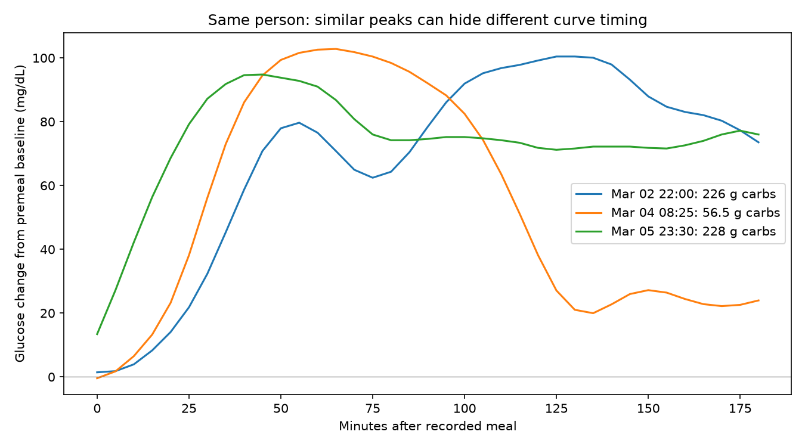

# Full-curve comparison after the carbohydrate failures

Reconstructed baseline-subtracted 0–180 minute curves at five-minute intervals for the same 738 eligible meals from original CGM files. All peaks reproduce the existing extraction within 1e-6. Reserved BIG IDEAs participants were not accessed. The regular grids are interpolated observations, not additional independent measurements.

## The example contains useful shape information

Participant 6's 56.5 g meal falls much faster after 100 minutes than the 226 g and 228 g meals. Third-hour positive response areas are 1467, 5369 and 4382 mg/dL·min respectively. This distinguishes these examples despite their similar peak heights and middle-hour areas. However, the two large meals peak 80 minutes apart, so peak timing alone does not consistently encode their similar carbohydrate amount. The meals also differ in protein, fat and time of day; the curve difference cannot be uniquely attributed to carbohydrate quantity.

## Does the apparent late-response rule generalize?

Before computing this diagnostic, specified comparisons within the same person whose peak heights differ by at most 10 mg/dL but whose recorded carbohydrate ±10% intervals do not overlap. Compared whether more carbohydrate consistently accompanies more late area, a higher final half-hour response, later peak time, or a larger third-hour share of positive area. Ties and undefined fractions are excluded individually. These are descriptive pairwise comparisons, not trained predictions or independent test examples.

| Feature increasing with carbohydrate | CGMacros pair agreement | BIG IDEAs development pair agreement |
|---|---:|---:|
| Third-hour positive area | 58.5% of 756 pairs | 47.3% of 165 pairs |
| Final half-hour mean response | 59.7% of 794 pairs | 48.5% of 171 pairs |
| Peak time | 56.7% of 748 pairs | 59.9% of 162 pairs |
| Third-hour share of response area | 59.3% of 755 pairs | 47.0% of 164 pairs |

Giving each person equal weight changes these ranges to 60.1–62.0% in CGMacros and 54.6–59.1% in BIG IDEAs. Pair reuse makes observations dependent. These percentages are neither gram accuracy nor significance estimates. The narrow check contradicts a reliable universal monotonic late-area conversion; it does not exclude a useful nonlinear interaction or personalized rule.

## Curve overlap is also substantial

Median curve RMSE between same-person exact recorded C/P/F repeats is 25.91 mg/dL in CGMacros (121 pairs) and 21.27 mg/dL in BIG IDEAs (27 pairs). Among same-person pairs at or below their dataset's repeat median distance, carbohydrate ±10% intervals are disjoint for 1522/2075 and 228/267 pairs respectively. Protein and fat also frequently have disjoint intervals at these distances. These are exploratory similarity comparisons using development labels, not irreducible error bounds. Exact macro labels do not guarantee identical ingredients, preparation or actual intake, and the median repeat distance is not a known sensor-noise threshold.

## Implication for the next analysis

Full curve shape resolves the selected example visually, but a simple late-response rule does not reproduce that separation reliably across the data. The next useful check is whether each person's earlier known meals support a repeatable carbohydrate conversion across different meal compositions and dose ranges. Distinguish narrow recipe recognition from dose estimation. Do not claim the ±10% goal is met, and do not combine unresolved carbohydrate, protein and fat algorithms into a claimed accurate system.

All 738 curves were finite; 30 randomly selected saved pair distances were independently recomputed within 1e-8. Pair tables, curve arrays, example feature rows, and extraction hashes accompany this report.
